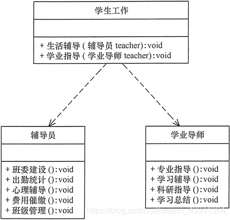

# 设计模式
## 设计模式六大原则
### 单一职责原则
单一职责原则简称 SRP，他想表达的就是字面意思，一个类只承担一个职责。

有时候我们可以将一个复杂的接口拆成两个不同的接口，这两个接口承担着不同的责任，这就是依赖了单一职责原则；它的定义就是：应该有且仅有一个原因引起类的变更。

关于职责的定义很模糊，什么才是职责呢？不同的人有不同的解读，所以该原则很难运用，需要开发者的慧眼。

下面以一个简单的例子展示

### 里氏替换原则
- 子类可以扩展父类的功能，但不能改变父类原有的功能；
- 只要父类出现的地方子类就可以出现，而且替换为子类不会出现任何错误。

### 依赖倒转原则
依赖倒置原则的 3 个含义：
- 高层模块不应该依赖低层模块，两者都应该依赖其抽象；
- 抽象不应该依赖细节；
- 细节应该依赖抽象；

这里的抽象指的就是接口或抽象类，细节指的是实现类 。
其核心思想是：要面向接口编程，不要面向实现编程。

为什么面向接口呢？面向接口就是面向抽象，由于在软件设计中，细节具有多变性，而抽象层则 相对稳定 ，因此以抽象为基础搭建起来的架构要比以细节为基础搭建起来的架构要稳定得多。

### 接口隔离原则
接口隔离原则（Interface Segregation Principle，ISP）要求程序员尽量将臃肿庞大的接口拆分成更小的和更具体的接口，让接口中只包含客户感兴趣的方法。
就是要让接口中的方法尽可能的少而精。
同时注意，根据接口隔离原则拆分接口时，首先必须满足单一职责原则，不能无限拆分。

### 迪米特法则

### 开闭原则
开闭原则是 Java 世界里最基础的设计原则，它指导我们如何建立一个稳定的、灵活的系统。
他要求软件实体应该对扩展开放，对修改关闭。
这里的软件实体包括：
- 模块；
- 抽象和类；
- 方法；

前面提到的几个原则都是开闭原则的具体形态，也就是说前五个原则就是指导设计的工具和方法，而开闭原则才是精神领袖。

开闭原则 在面向对象设计领域中的地位类似于牛顿第一定律在力学中的地位。