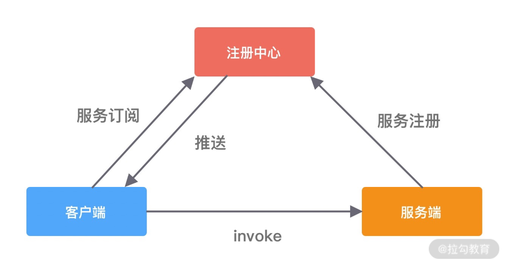
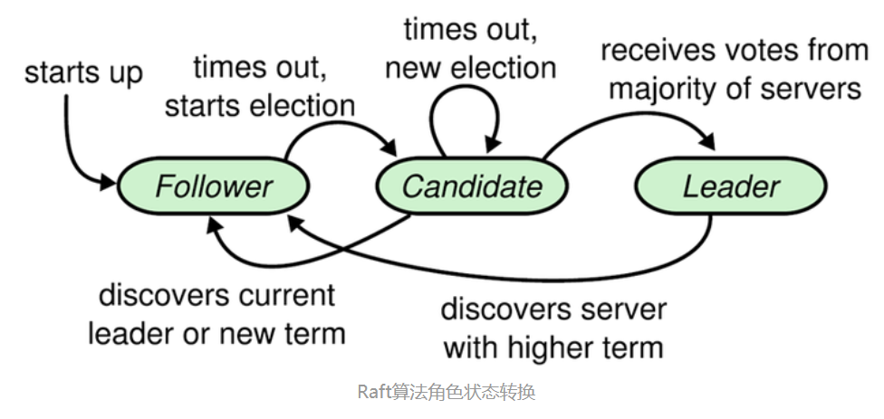

# 分布式系统
## RPC是什么
RPC 又称远程过程调用（Remote Procedure Call），用于解决分布式系统中服务之间的调用问题。通俗地讲，就是开发者能够像调用本地方法一样调用远程的服务。下图就是一个RPC框架的基本架构。

RPC 框架包含三个最重要的组件，分别是客户端、服务端和注册中心。在一次 RPC 调用流程中，这三个组件是这样交互的：
- 服务端在启动后，会将它提供的服务列表发布到注册中心，客户端向注册中心订阅服务地址；
- 客户端会通过本地代理模块 Proxy 调用服务端，Proxy 模块收到负责将方法、参数等数据转化成网络字节流；
- 客户端从服务列表中选取其中一个的服务地址，并将数据通过网络发送给服务端；
- 服务端接收到数据后进行解码，得到请求信息；
- 服务端根据解码后的请求信息调用对应的服务，然后将调用结果返回给客户端。
虽然 RPC 调用流程很容易理解，但是实现一个完整的 RPC 框架设计到很多内容，例如服务注册与发现、通信协议与序列化、负载均衡、动态代理等，下面我们一一进行初步地讲解。

## RPC和Restful Api的各自劣势
REST: 描述性的状态迁移，通用实现就是HTTP1.x，基于文本的传输协议
Restful Api的劣势：
- 基于文本的低效消息协议
- 应用程序之间缺乏强的类型接口
- Rest架构风格难以实施

Restful Api的优点：
- 耦合性低，兼容性好，提高开发效率
- 不用关心接口实现细节，相对更规范，更标准，更通用，跨语言支持

RPC缺点：
- 耦合性强
- 无法跨语言，平台较敏感

RPC优点：
- 调用简单，清晰，透明，不用像 rest 一样复杂，就像调用本地方法一样简单
- 高效低延迟，性能高
- 自定义协议（让传输报文提及更小）
- 性能消耗低，高效的序列化协议可以支持高效的二进制传输
- 自带负载均衡

## 如何设计一个自己的RPC框架，需要做什么
### 服务注册与发现
在分布式系统中，不同服务之间应该如何通信呢？传统的方式可以通过 HTTP 请求调用、保存服务端的服务列表等，这样做需要开发者主动感知到服务端暴露的信息，系统之间耦合严重。为了更好地将客户端和服务端解耦，以及实现服务优雅上线和下线，于是注册中心就出现了。

在 RPC 框架中，主要是使用注册中心来实现服务注册和发现的功能。服务端节点上线后自行向注册中心注册服务列表，节点下线时需要从注册中心将节点元数据信息移除。客户端向服务端发起调用时，自己负责从注册中心获取服务端的服务列表，然后在通过负载均衡算法选择其中一个服务节点进行调用。以上是最简单直接的服务端和客户端的发布和订阅模式，不需要再借助任何中间服务器，性能损耗也是最小的。

现在思考一个问题，服务在下线时需要从注册中心移除元数据，那么注册中心怎么才能感知到服务下线呢？我们最先想到的方法就是节点主动通知的实现方式，当节点需要下线时，向注册中心发送下线请求，让注册中心移除自己的元数据信息。但是如果节点异常退出，例如断网、进程崩溃等，那么注册中心将会一直残留异常节点的元数据，从而可能造成服务调用出现问题。

为了避免上述问题，实现服务优雅下线比较好的方式是采用主动通知 + 心跳检测的方案。除了主动通知注册中心下线外，还需要增加节点与注册中心的心跳检测功能，这个过程也叫作探活。心跳检测可以由节点或者注册中心负责，例如注册中心可以向服务节点每 60s 发送一次心跳包，如果 3 次心跳包都没有收到请求结果，可以任务该服务节点已经下线。

由此可见，采用注册中心的好处是可以解耦客户端和服务端之间错综复杂的关系，并且能够实现对服务的动态管理。服务配置可以支持动态修改，然后将更新后的配置推送到客户端和服务端，无须重启任何服务。

### 通信协议与序列化
既然 RPC 是远程调用，必然离不开网络通信协议。客户端在向服务端发起调用之前，需要考虑采用何种方式将调用信息进行编码，并传输到服务端。因为 RPC 框架对性能有非常高的要求，所以通信协议应该越简单越好，这样可以减少编解码的性能损耗。RPC 框架可以基于不同的协议实现，大部分主流 RPC 框架会选择 TCP、HTTP 协议，出名的 gRPC 框架使用的则是 HTTP2。TCP、HTTP、HTTP2 都是稳定可靠的，但其实使用 UDP 协议也是可以的，具体看业务使用的场景。成熟的 RCP 框架能够支持多种协议，例如阿里开源的 Dubbo 框架被很多互联网公司广泛使用，其中可插拔的协议支持是 Dubbo 的一大特色，这样不仅可以给开发者提供多种不同的选择，而且为接入异构系统提供了便利。

客户端和服务端在通信过程中需要传输哪些数据呢？这些数据又该如何编解码呢？如果采用 TCP 协议，你需要将调用的接口、方法、请求参数、调用属性等信息序列化成二进制字节流传递给服务提供方，服务端接收到数据后，再把二进制字节流反序列化得到调用信息，然后利用反射的原理调用对应方法，最后将返回结果、返回码、异常信息等返回给客户端。所谓序列化和反序列化就是将对象转换成二进制流以及将二进制流再转换成对象的过程。因为网络通信依赖于字节流，而且这些请求信息都是不确定的，所以一般会选用通用且高效的序列化算法。比较常用的序列化算法有 FastJson、Kryo、Hessian、Protobuf 等，这些第三方序列化算法都比 Java 原生的序列化操作都更加高效。Dubbo 支持多种序列化算法，并定义了 Serialization 接口规范，所有序列化算法扩展都必须实现该接口，其中默认使用的是 Hessian 序列化算法。

# 分布式一致性协议
## 2PC(两阶段提交协议)
两阶段提交的具体流程如下：
1、在第一阶段，事务管理器联络所有的资源管理器，通知它们准备提交事务；
2、各资源管理器返回完成准备（或准备失败）的消息给事务管理器（响应超时算作失败）；
在第二阶段：
如果所有资源管理器均完成准备，则事务管理器会通知所有资源管理器执行事务提交；
如果任一资源管理器准备失败，则事务管理器会通知所有资源管理器进行事务回滚。

## 3PC(三阶段提交协议)
把2PC的“提交事务请求”过程一分为二，形成了由canCommit、preCommit、doCommit三个阶段组成的事务处理协议。

阶段一：canCommit
事务询问
协调者向参与者发送canCommit请求。询问是否可以执行事务提交操作。然后开始等待参与者的响应。
响应反馈
参与者接到canCommit请求之后，正常情况下，如果其自身认为可以顺利执行事务，则返回Yes响应，并进入预备状态，否则反馈No。
 
阶段二：preCommit
正常情况下，包含两种可能：
情况1. 执行事务预提交
发送预提交请求
协调者向参与者发送preCommit请求，并进入prepared阶段。
事务预提交
参与者接收到preCommit请求后，会执行事务操作，并将Undo和Redo信息记录到事务日志中。
响应反馈
如果参与者成功的执行了事务操作，则返回Ack响应，同时开始等待最终指令：Commit或Abort。
情况2. 中断事务
假如任何一个参与者想协调者反馈了No响应，或者在等待超时之后，协调者无法接收到所有参与者的反馈响应，那么就会中断事务。
发送中断请求
协调者向所有参与者发送Abort请求。
中断事务
无论是收到来自协调者的Abort请求，或是等待协调者请求过程中出现超时，参与者都会中断事务。
 
阶段三：doCommit
情况1.执行提交
发送提交请求
协调接收到参与者发送的Ack响应，那么他将从预提交状态进入到提交状态。并向所有参与者发送doCommit请求。
事务提交
参与者接收到doCommit请求之后，执行正式的事务提交。并在完成事务提交之后释放所有事务资源。
响应反馈
事务提交完之后，向协调者发送Ack响应。
完成事务
协调者接收到所有参与者的Ack响应之后，完成事务。
情况2.中断事务
发送中断请求
协调者向所有参与者发送Abort请求
事务回滚
参与者接收到Abort请求之后，利用其在阶段二记录的Undo信息来执行事务的回滚操作，并在完成回滚之后释放所有的事务资源。
反馈结果
参与者完成事务回滚之后，向协调者发送Ack消息
中断事务
协调者接收到参与者反馈的Ack消息之后，执行事务的中断。

需要注意的是，一旦进入第三阶段，可能存在以下两种故障：
协调者出现问题
协调者和参与者之间的网络出现问题
无论哪种情况出现，最终都会导致参与者无法及时接收到来自协调者的doCommit或是abort请求，针对这样的异常情况，参与者都会在等待超时之后，继续进行事务提交。

## paxos算法详解
paxos算法类似于两阶段提交，也有准备阶段和提交阶段两个阶段。
1、Paxos中的每一个提议都有一个编号；不同的提议必须具有不同的编号。
2、在协议的1a阶段，提议者向接收者发送一条准备消息，其中具有他的提议编号n
3、在协议的1b阶段，接收到带有编号n的准备消息的接受者检查它是否已经响应过一条编号>=n的消息(相当于不会接受proposal id<=当前请求的prepare请求。如果是这样，它就忽略该消息。否则，它会记住编号n，并以其已经接收到的最高提议编号m的以及相应的值v进行相应。否则就返回空值
4、在2a阶段，提议者检查它是否得到大多数接收者的响应。如果是这样，那么就选择一个值v：如果所有的接收者都返回空值，则提议者可以随意选择一个值，否则选择最大编号m的值v
5、接收者收到一个带有值v和编号n的接受请求时，检查是否收到编号>n的prepare请求，如果是忽略该消息。否则它就会接受带有编号n的提议值v。

Paxos算法流程中的每条消息描述如下：
Prepare: Proposer生成全局唯一且递增的Proposal ID (可使用时间戳加Server ID)，向所有Acceptors发送Prepare请求，这里无需携带提案内容，只携带Proposal ID即可。
Promise: Acceptors收到Prepare请求后，做出“两个承诺，一个应答”。
两个承诺：
1. 不再接受Proposal ID小于等于（注意：这里是<= ）当前请求的Prepare请求。
2. 不再接受Proposal ID小于（注意：这里是< ）当前请求的Propose请求。
一个应答：
不违背以前作出的承诺下，回复已经Accept过的提案中Proposal ID最大的那个提案的Value和Proposal ID，没有则返回空值。

Propose: Proposer 收到多数Acceptors的Promise应答后，从应答中选择Proposal ID最大的提案的Value，作为本次要发起的提案。如果所有应答的提案Value均为空值，则可以自己随意决定提案Value。然后携带当前Proposal ID，向所有Acceptors发送Propose请求。
Accept: Acceptor收到Propose请求后，在不违背自己之前作出的承诺下，接受并持久化当前Proposal ID和提案Value。
Learn: Proposer收到多数Acceptors的Accept后，决议形成，将形成的决议发送给所有Learners。

## raft算法详解
不同于Paxos算法直接从分布式一致性问题出发推导出来，Raft算法则是从多副本状态机的角度提出，用于管理多副本状态机的日志复制。Raft实现了和Paxos相同的功能，它将一致性分解为多个子问题：Leader选举（Leader election）、日志同步（Log replication）、安全性（Safety）、日志压缩（Log compaction）、成员变更（Membership change）等。同时，Raft算法使用了更强的假设来减少了需要考虑的状态，使之变的易于理解和实现。

Raft将系统中的角色分为领导者（Leader）、跟从者（Follower）和候选人（Candidate）：
Leader：接受客户端请求，并向Follower同步请求日志，当日志同步到大多数节点上后告诉Follower提交日志。
Follower：接受并持久化Leader同步的日志，在Leader告之日志可以提交之后，提交日志。
Candidate：Leader选举过程中的临时角色。

Raft要求系统在任意时刻最多只有一个Leader，正常工作期间只有Leader和Followers。

Raft算法角色状态转换如下：

Follower只响应其他服务器的请求。如果Follower超时没有收到Leader的消息，它会成为一个Candidate并且开始一次Leader选举。收到大多数服务器投票的Candidate会成为新的Leader。Leader在宕机之前会一直保持Leader的状态。

Raft算法将时间分为一个个的任期（term），每一个term的开始都是Leader选举。在成功选举Leader之后，Leader会在整个term内管理整个集群。如果Leader选举失败，该term就会因为没有Leader而结束。

### Leader选举
Raft 使用心跳（heartbeat）触发Leader选举。当服务器启动时，初始化为Follower。Leader向所有Followers周期性发送heartbeat。如果Follower在选举超时时间内没有收到Leader的heartbeat，就会等待一段随机的时间后发起一次Leader选举。

Follower将其当前term加一然后转换为Candidate。它首先给自己投票并且给集群中的其他服务器发送 RequestVote RPC （RPC细节参见八、Raft算法总结）。结果有以下三种情况：

赢得了多数的选票，成功选举为Leader；
收到了Leader的消息，表示有其它服务器已经抢先当选了Leader；
没有服务器赢得多数的选票，Leader选举失败，等待选举时间超时后发起下一次选举。

选举出Leader后，Leader通过定期向所有Followers发送心跳信息维持其统治。若Follower一段时间未收到Leader的心跳则认为Leader可能已经挂了，再次发起Leader选举过程。

Raft保证选举出的Leader上一定具有最新的已提交的日志，这一点将在四、安全性中说明。

### 日志同步
Leader选出后，就开始接收客户端的请求。Leader把请求作为日志条目（Log entries）加入到它的日志中，然后并行的向其他服务器发起 AppendEntries RPC （RPC细节参见八、Raft算法总结）复制日志条目。当这条日志被复制到大多数服务器上，Leader将这条日志应用到它的状态机并向客户端返回执行结果。

某些Followers可能没有成功的复制日志，Leader会无限的重试 AppendEntries RPC直到所有的Followers最终存储了所有的日志条目。

日志由有序编号（log index）的日志条目组成。每个日志条目包含它被创建时的任期号（term），和用于状态机执行的命令。如果一个日志条目被复制到大多数服务器上，就被认为可以提交（commit）了。

某些Followers可能没有成功的复制日志，Leader会无限的重试 AppendEntries RPC直到所有的Followers最终存储了所有的日志条目。

日志由有序编号（log index）的日志条目组成。每个日志条目包含它被创建时的任期号（term），和用于状态机执行的命令。如果一个日志条目被复制到大多数服务器上，就被认为可以提交（commit）了。

上图阐述了一些Followers可能和新的Leader日志不同的情况。一个Follower可能会丢失掉Leader上的一些条目，也有可能包含一些Leader没有的条目，也有可能两者都会发生。丢失的或者多出来的条目可能会持续多个任期。

Leader通过强制Followers复制它的日志来处理日志的不一致，Followers上的不一致的日志会被Leader的日志覆盖。

Leader为了使Followers的日志同自己的一致，Leader需要找到Followers同它的日志一致的地方，然后覆盖Followers在该位置之后的条目。

Leader会从后往前试，每次AppendEntries失败后尝试前一个日志条目，直到成功找到每个Follower的日志一致位点，然后向后逐条覆盖Followers在该位置之后的条目。

### Raft与multi-paxos的异同
**相似的概念**
| Raft | Paxos | 
| :----:| :----: |
| Leader | Proposer | 
| Term | Proposal Id |
| Log | Proposal Value | 
| Log Index | Instance Id |
| RequestVote | Prepare阶段 |
| AppendEntries | Accept阶段 |

**不同之处**
|  | Raft | Paxos | 
| :----:| :----: | :----: |
| 领导者 | 唯一leader | 允许多个proposer |
| 领导者选举权 | 具有最新提交的日志的副本 | 任意副本 |
| 日志连续性 | 保证连续 | 允许空洞 | 
| 日志提交 | 推进commit Index | 异步的commit消息 |