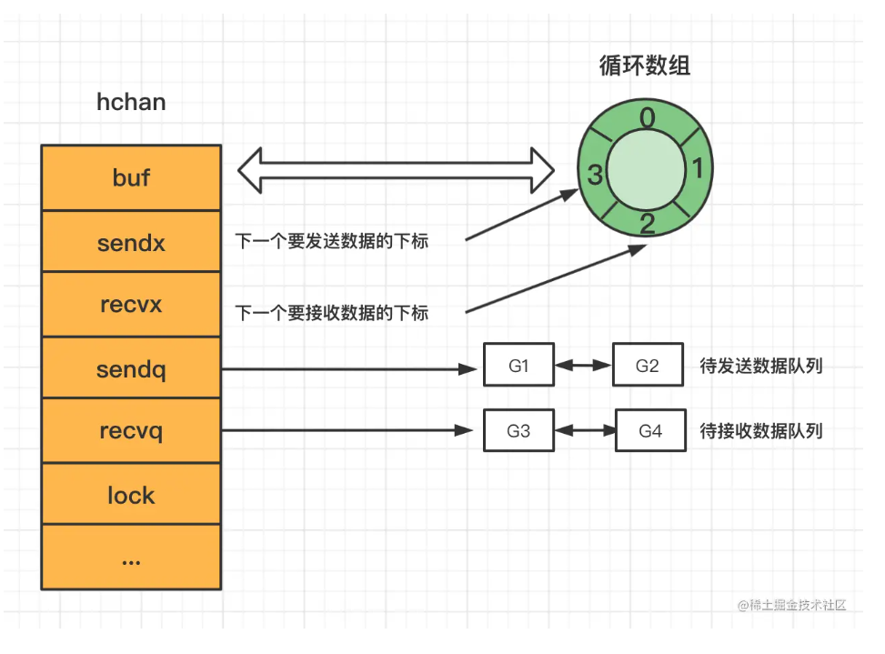
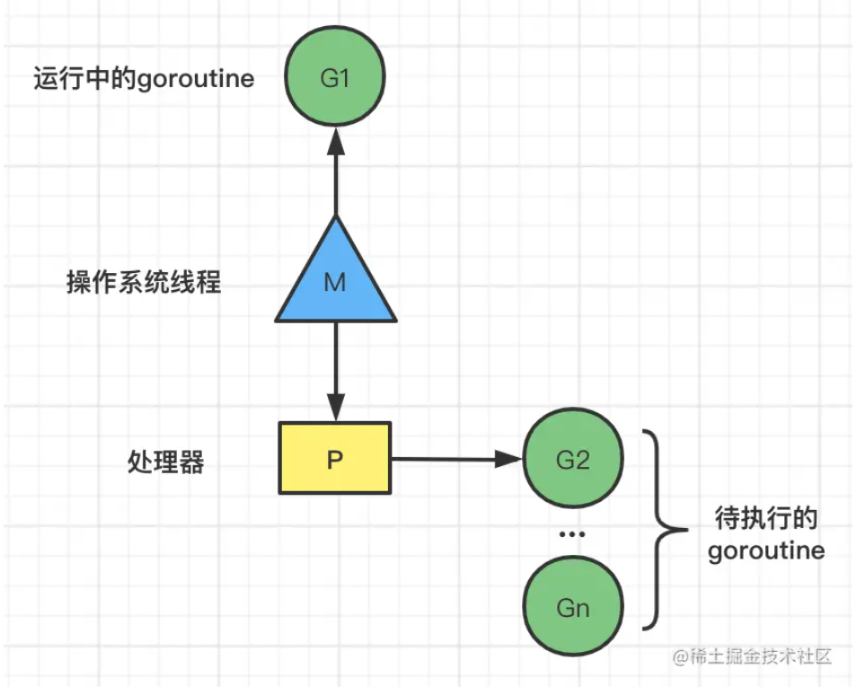
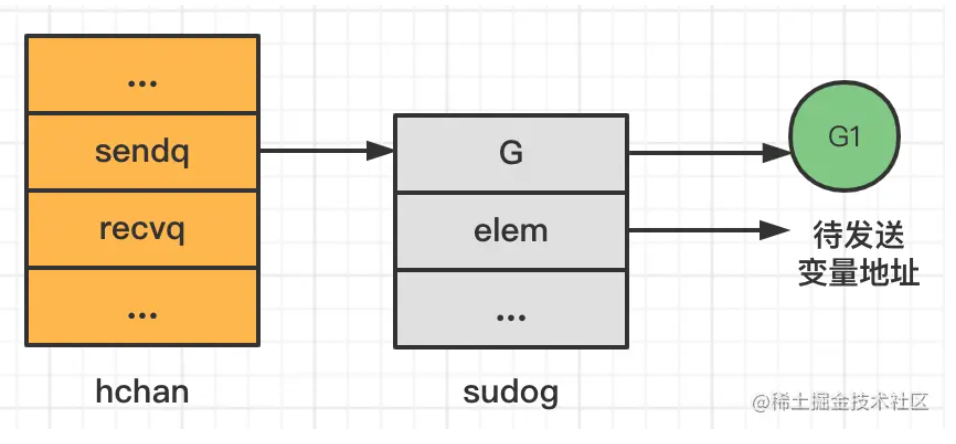
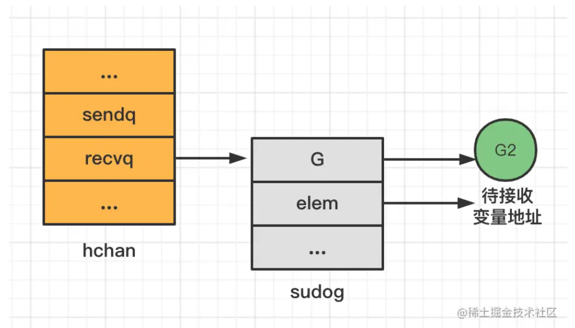

# Go语言
## Go语言经典语法问题
1、函数执行时，如果由于panic导致了异常，则延迟函数不会执行。这一说法是否正确？
这个说法是不正确的。当一个 Go 函数由于 panic 异常而退出时，所有已经注册的延迟函数(defer)都会被执行，然后 panic 异常会继续向外传递。 也就是说，在 Go 中，延迟函数(defer)的执行是不受 panic异常的影响的。

在 Go 中，defer 的实现原理是通过栈的方式来实现的。

当一个 defer 语句被执行时，它所在的函数的信息会被保存在一个栈中，同时 defer 语句中的函数也会被保存在另外一个栈中。如果函数正常返回，那么 defer 栈中的函数会被按照后进先出（LIFO）的顺序执行。如果函数由于 panic 异常而退出，那么 defer 栈中的函数同样会被执行，也按照 LIFO 的顺序依次执行。

defer 的使用场景主要包括资源释放、异常处理、代码简化等方面。当我们需要在函数返回前执行一些操作，或者在程序出现异常时进行一些清理工作，或者需要将一些函数调用作为一个整体进行执行时，都可以使用 defer 来满足这些需求。

2、对于以下代码，描述正确的是：
```Go
func myTest1() {
	var wg sync.WaitGroup
	intSlice := []int{1, 2, 3, 4, 5}
	wg.Add(len(intSlice))
	ans1, ans2 := 0, 0
	for _, v := range intSlice {
		vv := v
		go func() {
			fmt.Printf("v = %v,vv=%v\n", v, vv)
			defer wg.Done()
			ans1 += v
			ans2 += vv
		}()
	}
	wg.Wait()
	fmt.Printf("ans1:%v,ans2:%v", ans1, ans2)
}
```
ans1和ans2都不一定为15。这段代码的执行结果是不确定的，因为多个 goroutine 并发执行，所以 ans1 和 ans2 的在该代码中，ans1 和 ans2 的初始值都为 0，多个 goroutine 并发执行 ans1 += v 和 ans2 += vv，会导致数据竞争，因此无法确定它们的最终值。虽然在该代码中，vv 变量已经通过值传递传递到了匿名函数里面，但是在 goroutine 开始执行之前循环可能已经继续执行了，此时 vv 变量的值可能会被修改。这就会导致 ans2 的值无法确定，因为 ans2 受制于 vv 的值，而 vv 的值在多个 goroutine 并发执行时可能不是我们预期的。因此，对于这种情况，我们需要使用 sync.Mutex 进行加锁来保证多个 goroutine 不会同时访问和修改变量的值。

3、golang是一门面向对象的语言吗？
Golang 是一门面向对象的编程语言，但是它比传统的面向对象语言更加强调组合而非继承来实现代码复用。在 Golang 中，类（class）的概念被替换为结构体（struct）和方法（method），它们可以实现封装、继承和多态等面向对象的特性。同时，Golang 也提供了接口（interface）来实现多态性，但是接口的实现是由具体的类型来实现的，而不是基于继承的子类继承父类的方式。

因此，虽然 Golang 不像 Java 或 C# 那样强调面向对象编程，但是它仍然是一门支持面向对象编程的语言。

## Go语言经典面试问题
1、golang中切片容量增长
在golang1.18版本后，扩容策略变为：当原slice容量(oldcap)小于256的时候，新slice(newcap)容量为原来的2倍；原slice容量超过256，新slice容量newcap = oldcap+(oldcap+3*256)/4

2、下面的例子显示了，在函数中改变一个map在调用方的map也会跟着改变
在函数中修改slice的值调用方的slice也会改变，但append则不一定，因为可能发生扩容
```Go
import "fmt"

func main() {
	myMap := map[string]interface{}{}
	myMap["abc"] = 1
	fmt.Println(myMap)
	changeMap(myMap)
	fmt.Println(myMap)

	intSlice := []int{1, 2, 3, 4}
	fmt.Println(intSlice)
	changeSlice(intSlice)
	fmt.Println(intSlice)
	appendSlice(intSlice)
	fmt.Println(intSlice)
}

//在函数中改变一个map在主函数中也会改变
func changeMap(mtc map[string]interface{}) {
	mtc["efg"] = 2
}

func changeSlice(intSlice []int) {
	for i := range intSlice {
		intSlice[i] = 4
	}
}

func appendSlice(intSlice []int) {
	intSlice = append(intSlice, 0)
}
```

3、Golang的channel是如何实现并发安全的
Go 语言中的 channel 通过使用并发原语实现并发安全。在底层，channel 是通过使用同步原语（mutexes、condition variables）和原子操作（atomic operations）来实现的，并且遵循 happens-before 原则。

具体来说，channel 有两个基本操作：发送和接收。在发送过程中，channel 首先会检查是否有其他 goroutine 正在接收 channel 中的值，如果有，则将值直接传递给接收方，并激活接收方的 goroutine。如果没有，则将值放入一个队列中，并等待其他 goroutine 执行接收操作。在接收过程中，channel 会检查是否有其他 goroutine 正在发送值，如果有，则直接获取该值并返回。如果没有，则从队列中取出一个值，并将其传递给发送方，然后激活发送方的 goroutine。

这些操作都是原子的，因此 channel 可以安全地在多个 goroutine 之间共享。此外，Go 语言中的 channel 还具有先进先出的特性，保证了多个 goroutine 在使用同一个 channel 时不会出现竞争条件的问题。

需要注意的是，虽然 channel 是并发安全的，但是如果使用不当，仍然可能会出现一些问题，如死锁、阻塞等。因此，在使用 channel 时应该注意它们的容量、发送和接收的时机，以及它们的使用方式。

4、golang的Channel实现原理
channel是golang语言中用于实现多个goroutine, 底层为hchan结构体。在go的runtime包下

```go
type hchan struct {
	//channel 分为有缓冲和无缓冲两种
	//对于有缓冲的channel存储数据，借助的就是一个底层的循环数组结构
	qcount   uint           // 循环数组中的元素数量
	dataqsiz uint           // 循环数组的长度
	buf      unsafe.Pointer // 指向底层循环数组的指针
	elemsize uint16 //能够收发元素的大小

	closed   uint32   //channel是否关闭的标志
	elemtype *_type //channel中的元素类型
  
  //有缓冲channel内的缓冲数组会被作为一个“环型”来使用。
  //当下标超过数组容量后会回到第一个位置，所以需要有两个字段记录当前读和写的下标位置
	sendx    uint   // 下一次发送数据的下标位置
	recvx    uint   // 下一次读取数据的下标位置
  
  //当循环数组中没有数据时，收到了接收请求，那么接收数据的变量地址将会写入读等待队列
  //当循环数组中数据已满时，收到了发送请求，那么发送数据的变量地址将写入写等待队列
	recvq    waitq  // 读等待队列
	sendq    waitq  // 写等待队列

	lock mutex //互斥锁，保证读写channel时不存在并发竞争问题
}
```
hchan的结构体主要组成部分有4个：
 - 用于保存goroutine之间传递数据的循环链表=>buf
 - 用于记录此循环链表当前发送或者接受数据的下标值=> sendx和recvx
 - 用于保存向该chan发送和从改chan接收数据的goroutine的队列。=> sendq 和 recvq
 - 保证channel写入和读取数据时线程安全的锁。 => lock

其示意图如下：



**下面举个例子**
```go
//G1
func sendTask(taskList []Task) {
	...
  
	ch:=make(chan Task, 4) // 初始化长度为4的channel
	for _,task:=range taskList {
		ch <- task  //发送任务到channel
	}
  
	...
}

//G2
func handleTask(ch chan Task) {
	for {
		task:= <-ch //接收任务
		process(task) //处理任务
	}
}
```

ch是长度为4的带缓冲的channel，G1是发送者，G2是接收者

初始hchan结构体重的buf为空，sendx和recvx均为0。
当G1向ch里发送数据时，首先会对buf加锁，然后将数据copy到buf中，然后sendx++，然后释放对buf的锁。
当G2消费ch的时候，会首先对buf加锁，然后将buf中的数据copy到task变量对应的内存里，然后recvx++,并释放锁。

可以发现整个过程，G1和G2没有共享的内存，底层是通过hchan结构体的buf，并使用copy内存的方式进行通信，最后达到了共享内存的目的，这里也体现了Go中的CSP并发模型。

```
Go语言所倡导的CSP模型就是通过goroutine和channel来实现的
CSP模型指的就是：通过通信来共享内存，而非通过共享内存来通信
```
### 那么当channel中的缓存满了之后会发生什么呢
首先先看一下GMP的概念:



【G】goroutine是Golang实现的用户空间的轻量级的线程
【M】代表操作系统线程
【P】处理器, 它包含了待运行goroutine。
如果线程M想运行goroutine，必须先获取P，从P中获取goroutine执行。

当G1向buf已经满了的ch发送数据的时候，检测到hchan的buf已经满了，会通知调度器，调度器会将G1的状态设置为waiting, 并移除与线程M的联系，然后从P的runqueue中选择一个goroutine在线程M中执行，此时G1就是阻塞状态，但是不是操作系统的线程阻塞，所以这个时候只用消耗少量的资源。

那么G1设置为waiting状态后去哪了？怎们去resume呢？我们再回到hchan结构体，注意到hchan有个sendq的成员，其类型是waitq，查看源码如下：

```go
type hchan struct {
	...
  recvq    waitq  // 读等待队列
	sendq    waitq  // 写等待队列
	...
}

type waitq struct {
	first *sudog
	last *sudog
}
```

实际上，当G1变为waiting状态后，会创建一个代表自己的sudog的结构，然后放到sendq这个list中，sudog结构中保存了channel相关的变量的指针(如果该Goroutine是sender，那么保存的是待发送数据的变量的地址，如果是receiver则为接收数据的变量的地址，之所以是地址，前面我们提到在传输数据的时候使用的是copy的方式) 其示意图如下图所示：



当G2从ch中接收一个数据时，会通知调度器，设置G1的状态为runnable，然后将加入P的runqueue里，等待线程执行.

前面我们是假设G1先运行，如果G2先运行会怎么样呢？
如果G2先运行，那么G2会从一个empty的channel里取数据，这个时候G2就会阻塞，和前面介绍的G1阻塞一样，G2也会创建一个sudog结构体，保存接收数据的变量的地址，但是该sudog结构体是放到了recvq列表里。



当G1向ch发送数据的时候，为了提升效率，runtime并不会对hchan结构体题的buf进行加锁，而是直接将G1里的发送到ch的数据copy到了G2 sudog里对应的elem指向的内存地址！【不通过buf】

## golang语言goroutineh和GPM模型详解
### 进程(process)、线程(thread)与协程(coroutine)的区别
进程进程是一个程序在一个数据集中的一次动态执行过程，可以简单理解为“正在执行的程序”，它是CPU资源分配和调度的独立单位。 进程一般由程序、数据集、进程控制块三部分组成。我们编写的程序用来描述进程要完成哪些功能以及如何完成；数据集则是程序在执行过程中所需要使用的资源；进程控制块用来记录进程的外部特征，描述进程的执行变化过程，系统可以利用它来控制和管理进程，它是系统感知进程存在的唯一标志。 进程的局限是创建、撤销和切换的开销比较大。

线程线程是在进程之后发展出来的概念。 线程也叫轻量级进程，它是一个基本的CPU执行单元，也是程序执行过程中的最小单元，由线程ID、程序计数器、寄存器集合和堆栈共同组成。一个进程可以包含多个线程。 线程的优点是减小了程序并发执行时的开销，提高了操作系统的并发性能，缺点是线程没有自己的系统资源，只拥有在运行时必不可少的资源，但同一进程的各线程可以共享进程所拥有的系统资源，如果把进程比作一个车间，那么线程就好比是车间里面的工人。不过对于某些独占性资源存在锁机制，处理不当可能会产生“死锁”。

协程协程是一种用户态的轻量级线程，又称微线程，英文名Coroutine，协程的调度完全由用户控制。人们通常将协程和子程序（函数）比较着理解。 子程序调用总是一个入口，一次返回，一旦退出即完成了子程序的执行。

与传统的系统级线程和进程相比，协程的最大优势在于其"轻量级"，可以轻松创建上百万个而不会导致系统资源衰竭，而线程和进程通常最多也不能超过1万的。这也是协程也叫轻量级线程的原因。

协程的特点在于是一个线程执行，与多线程相比，其优势体现在：协程的执行效率极高。因为子程序切换不是线程切换，而是由程序自身控制，因此，没有线程切换的开销，和多线程比，线程数量越多，协程的性能优势就越明显。

### goroutine是什么
Go为了提供更容易使用的并发方法，使用了goroutine和channel。goroutine来自协程的概念，让一组可复用的函数运行在一组线程之上，即使有协程阻塞，该线程的其他协程也可以被runtime调度，转移到其他可运行的线程上。最关键的是，程序员看不到这些底层的细节，这就降低了编程的难度，提供了更容易的并发。

Go中，协程被称为goroutine，它非常轻量，一个goroutine只占几KB，并且这几KB就足够goroutine运行完，这就能在有限的内存空间内支持大量goroutine，支持了更多的并发。虽然一个goroutine的栈只占几KB，但实际是可伸缩的，如果需要更多内容，runtime会自动为goroutine分配。

Goroutine特点：
- 占用内存更小（几kb）
- 调度更灵活(runtime调度)

## go语言垃圾回收详解
**什么是根对象**
根对象是指赋值器不需要通过其他对象就可以直接访问到的对象，通过Root对象, 可以追踪到其他存活的对象。常见的root对象有：

全局变量：程序在编译期就能确定的那些存在于程序整个生命周期的变量。
执行栈：每个 goroutine (包括main函数)都拥有自己的执行栈，这些执行栈上包含栈上的变量及堆内存指针。【堆内存指针即在gorouine中申请或者引用了在堆内存的变量】

**三色标记法**
1、初始时，所有对象都被标记为白色

2、GC开始时，遍历rootSet，将直接可达的对象标记为灰色

3、遍历灰色对象，将直接可达的对象标记为灰色，并将自己标记为黑色

4、重复第3步，直到标记完成所有的对象

5、将标记为白色的对象当成垃圾回收掉

对于上述的三色标记法来讲,仍然需要依赖STW的. 因为如果不暂停程序, 程序的逻辑改变对象引用关系, 这种动作如果在标记阶段做了修改，会影响标记结果的正确性。

**强三色不变式和弱三色不变式**
强三色不变式规则：不允许黑色对象引用白色对象

弱三色不变式规则：黑色对象可以引用白色对象，但是白色对象的上游必须存在灰色对象

**屏障机制**
插入写屏障：
规则：当一个对象引用另外一个对象时，将另外一个对象标记为灰色。
满足：强三色不变式。不会存在黑色对象引用白色对象

对于插入写屏障来讲，其最大的弊端就是，在一次正常的三色标记流程结束后，需要对栈上重新进行一次stw，然后再rescan一次。

删除写屏障:
规则：在删除引用时，如果被删除引用的对象自身为灰色或者白色，那么被标记为灰色。

满足弱三色不变式。灰色对象到白色对象的路径不会断

v1.8引入了混合写屏障机制
讲到这里，如果是你，你会怎么做呢？当然是取其精华，去其糟泊啦…没错，Golang团队，正是结合了这两点，在v1.8版本下引入了混合写屏障机制。下面我们看下混合屏障机制的核心定义：

GC刚开始的时候，会将栈上的可达对象全部标记为黑色。
GC期间，任何在栈上新创建的对象，均为黑色。
上面两点只有一个目的，将栈上的可达对象全部标黑，最后无需对栈进行STW，就可以保证栈上的对象不会丢失。有人说，一直是黑色的对象，那么不就永远清除不掉了么，这里强调一下，标记为黑色的是可达对象，不可达的对象一直会是白色，直到最后被回收。
堆上被删除的对象标记为灰色
堆上新添加的对象标记为灰色

### go语言是如何进行网络IO中断的
在Go语言中，网络I/O模型是基于事件驱动的、非阻塞的模型。它使用了一种称为"多路复用器"（Multiplexer）的机制来管理和调度网络事件。这个多路复用器在Go语言中是通过标准库中的`net`和`net/http`包来实现的。

当你在一个协程中发送网络请求时，实际上是将请求提交给了多路复用器。多路复用器会负责在底层的操作系统层面上，监听和处理网络事件，比如连接建立、数据可读、数据可写等。它会将这些事件通知到相应的协程中。

当多路复用器接收到一个网络事件时，它会根据事件的类型和相关的信息来确定是哪个协程发起的这个网络请求。然后，它会唤醒对应的协程，让它继续处理响应的数据。

具体来说，多路复用器会为每个网络连接分配一个唯一的标识符，通常是一个整数。这个标识符可以被用来追踪和区分不同的连接。当网络事件发生时，多路复用器会将事件和相应的连接标识符一起通知到对应的协程。

协程可以通过读取连接套接字上的数据来获取服务器发送的响应报文。多路复用器会确保只有对应的协程才能读取到它自己关注的连接上的数据。这样，每个协程都可以独立地处理自己发起的请求和接收到的响应。

总结来说，Go语言使用多路复用器来管理和调度网络事件，通过唯一的连接标识符将网络事件与发起请求的协程关联起来，确保每个协程只处理自己关注的连接上的数据。这种设计使得在协程中处理网络请求和响应变得简单和高效。
