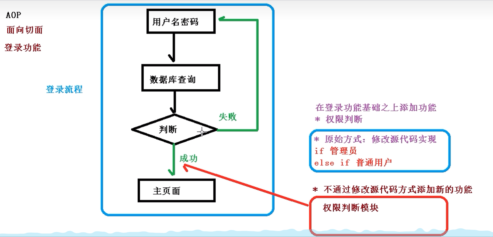
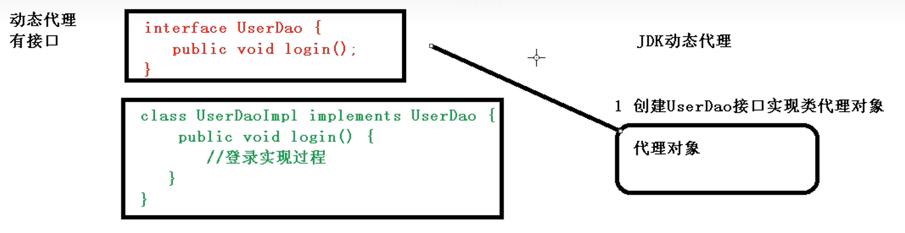
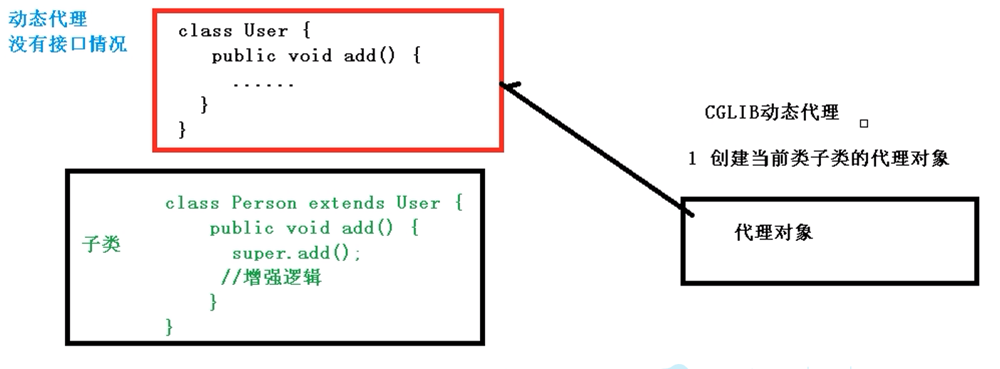

# Java

## Spring学习笔记
### Spring框架概述
1、Spring是轻量级的开源JavaEE框架

2、解决企业应用开发的复杂性

3、Spring两个核心部分：IOC与AOP

(1)IOC: 控制反转(Inversion of Control),把创建对象的过程交给Spring进行管理

(2)AOP: 面向切面，不修改源代码的情况下进行功能增强

4、关于Spring框架的特点
(1) 方便解耦，简化开发
(2) AOP编程的支持
(3) 声明式事务的支持
(4) 方便程序测试
(5) 方便和其他框架进行整合
(6) 降低JavaEE API的使用难度

5、Spring5版本

### 入门案例

类似于HelloWorld

### Spring5 IOC

#### IOC底层原理
1、什么是IOC: 控制反转，是面向对象编程中一种设计原则，可以用于降低计算机代码之间的耦合度。其中最常见的方式叫做依赖注入(DI)。

把对象创建和对象之间的调用过程都交给Spring管理

目的：降低耦合度

2、IOC底层原理

(1) XML解析、工厂模式、反射

**IOC 过程：**

第一步 XML配置文件，配置创建的对象

第二步 有service类和dao类，创建工厂类

(2) IOC的接口

**IOC(接口)**

1、IOC思想基于IOC容器完成，IOC容器底层就是对象工厂

2、Spring提供了IOC容器实现的两种方式:（两个接口）
(1)BeanFactory: IOC容器基本实现，是Spring内部的使用接口，不提供开发人员进行使用
特点：加载配置文件时，不会创建对象，在获取对象(使用)时才去创建对象

(2)ApplicationContext: BeanFactory接口的子接口，提供更多更强大的功能，一般由开发人员进行使用
特点：加载配置文件时就会把在配置文件对象进行创建

3、ApplicationContext实现类
FileSystemXmlApplicationContext(文件路径)
ClassPathXmlApplicationContext(src下的路径)
 
#### IOC操作Bean管理

1、什么是Bean管理
(1)Spring创建对象
(2)Spring注入属性（内部的成员变量等）

2、Bean管理操作有两种方式
(1)基于XML配置文件方式实现
(2)基于注解方式实现

**IOC操作Bean管理(基于XML方式)**
1、基于XML方式创建对象
(1)在Spring配置文件中，使用bean标签，标签里面添加对应属性，就可以实现对象创建
(2)在bean标签有很多属性，介绍常用的属性
*id属性：对象的唯一标识
*class属性:创建对象的类的全路径(包和类的路径)
*name属性:作用与id一致，只是name支持一些特殊符号（一般不用）
(3)创建对象时候，默认也是执行无参数构造方法

2、基于XML方式注入属性
(1)DI:依赖注入，就是注入属性
必须先创建对象
第一种注入方式：使用set方法进行注入
(2)在XML文件中修改


第二种注入方式：使用有参数构造进行注入
(1)创建类，定义属性，创建属性对应的有参构造方法

(2)在XML文件中修改

```XML
<!--配置User对象创建-->
<bean id="user" class="com.atguigu.spring5.User"></bean>

<!--set方法注入属性-->
<bean id="book" class="com.atguigu.spring5.Book">
    <!--使用property标签完成属性注入
        name:类里面的属性名称
        value:向属性注入的值
    -->
    <property name="bookName" value="goodBook"></property>
    <property name="author" value="ZXY"></property>
</bean>

<!-- 通过有参构造函数注入属性 -->
<bean id = "orders" class="com.atguigu.spring5.Orders">
    <constructor-arg name="orderName" value="Myorder"></constructor-arg>
    <constructor-arg name="address" value="China"></constructor-arg>
    <!-- 也可以通过index注入属性，但通过名称更准确 -->
    <constructor-arg index="0" value="Myorder"></constructor-arg>
    <constructor-arg index="1" value="China"></constructor-arg>
</bean>
```

5、p名称空间注入
(1)使用p名称空间注入，可以简化基于XML配置方式
第一步 添加p名称空间在配置文件中

第二步 修改名称注入

```XML
<?xml version="1.0" encoding="UTF-8"?>
<beans xmlns="http://www.springframework.org/schema/beans"
       xmlns:xsi="http://www.w3.org/2001/XMLSchema-instance"
       xmlns:p="http://www.springframework.org/schema/p"
       xsi:schemaLocation="http://www.springframework.org/schema/beans http://www.springframework.org/schema/beans/spring-beans.xsd">

   <!--配置User对象创建-->
    <bean id="user" class="com.atguigu.spring5.User"></bean>

    <!--set方法注入属性-->
    <bean id="book" class="com.atguigu.spring5.Book" p:bookName="mybook" p:author="zxy">
    </bean>

    <!-- 通过有参构造函数注入属性 -->
    <bean id = "orders" class="com.atguigu.spring5.Orders">
        <constructor-arg name="orderName" value="Myorder"></constructor-arg>
        <constructor-arg name="address" value="China"></constructor-arg>
    </bean>
</beans>
```

6、XML注入其他属性类型(空值、对象、集合)
(1)字面量
```XML
<!--null值-->
<property name="address">
    <null></null>
</property>
```
(2)属性值包含特殊符号
1、把<>进行转义&lt;&gt;
2、把带特殊符号的内容写到CDATA

```XML
<!--属性值包含特殊符号
    1、把尖括号进行转义
    2、把带特殊符号的内容写到CDATA
-->
<property name="address" >
    <value><![CDATA[<<南京>>]]></value>
</property>
```

2、注入属性-外部bean
(1) 创建两个类service类和dao类
(2) 在service调用dao里面的方法
(3) 在Spring配置文件中进行配置
```XML
<?xml version="1.0" encoding="UTF-8"?>
<beans xmlns="http://www.springframework.org/schema/beans"
       xmlns:xsi="http://www.w3.org/2001/XMLSchema-instance"
       xsi:schemaLocation="http://www.springframework.org/schema/beans http://www.springframework.org/schema/beans/spring-beans.xsd">

      <!--1 service和dao对象创建-->
      <bean id="userService" class="com.atguigu.spring5.service.UserService">
          <!--注入userDao对象
            name属性值:类里面的属性名称
            ref属性:创建userDao对象的bean标签id值
          -->
          <property name="userDao" ref="userDaoImpl"></property>
      </bean>
    <bean id="userDaoImpl" class="com.atguigu.spring5.dao.UserDaoImpl"></bean>
</beans>
```

3、注入属性-内部Bean和级联赋值
(1)一对多关系：部门与员工之间的关系
一个部门有多个员工，一个员工属于一个部门
部门为一，员工为多
(2)在实体类之间表示一个一对多关系
(3)在Spring配置文件中进行配置
```XML
<?xml version="1.0" encoding="UTF-8"?>
<beans xmlns="http://www.springframework.org/schema/beans"
       xmlns:xsi="http://www.w3.org/2001/XMLSchema-instance"
       xsi:schemaLocation="http://www.springframework.org/schema/beans http://www.springframework.org/schema/beans/spring-beans.xsd">

    <!--内部bean-->
    <bean id="emp" class="com.atguigu.spring5.bean.Employee">
        <!--先设置两个普通属性-->
        <property name="employeeName" value="Zhouxinyi"></property>
        <property name="gender" value="女"></property>
        <property name="department">
            <bean id="dept" class="com.atguigu.spring5.bean.Department">
                <property name="departmentName" value="后台开发"></property>
            </bean>
        </property>
    </bean>
</beans>
```
(4)级联赋值
1、第一种写法
```XML
<?xml version="1.0" encoding="UTF-8"?>
<beans xmlns="http://www.springframework.org/schema/beans"
       xmlns:xsi="http://www.w3.org/2001/XMLSchema-instance"
       xsi:schemaLocation="http://www.springframework.org/schema/beans http://www.springframework.org/schema/beans/spring-beans.xsd">

    <!--级联赋值-->
    <bean id="emp" class="com.atguigu.spring5.bean.Employee">
        <!--先设置两个普通属性-->
        <property name="employeeName" value="Zhouxinyi"></property>
        <property name="gender" value="男"></property>
        <!--级联赋值-->
        <property name="department" ref="dept"></property>
    </bean>

    <bean id="dept" class="com.atguigu.spring5.bean.Department">
        <property name="departmentName" value="财务部"></property>
    </bean>
</beans>
```

2、第二种写法
首先，定义一个getter方法。然后修改XML文件
```XML
<?xml version="1.0" encoding="UTF-8"?>
<beans xmlns="http://www.springframework.org/schema/beans"
       xmlns:xsi="http://www.w3.org/2001/XMLSchema-instance"
       xsi:schemaLocation="http://www.springframework.org/schema/beans http://www.springframework.org/schema/beans/spring-beans.xsd">

    <!--级联赋值-->
    <bean id="emp" class="com.atguigu.spring5.bean.Employee">
        <!--先设置两个普通属性-->
        <property name="employeeName" value="Zhouxinyi"></property>
        <property name="gender" value="男"></property>
        <!--级联赋值-->
        <property name="department" ref="dept"></property>
        <property name="department.departmentName" value="技术部"></property>
    </bean>

    <bean id="dept" class="com.atguigu.spring5.bean.Department">
        <property name="departmentName" value="财务部"></property>
    </bean>
</beans>
```

(5)XML注入集合属性
1、注入数组类型属性
2、注入List集合类型属性
3、注入Map集合类型属性
```XML
<?xml version="1.0" encoding="UTF-8"?>
<beans xmlns="http://www.springframework.org/schema/beans"
       xmlns:xsi="http://www.w3.org/2001/XMLSchema-instance"
       xsi:schemaLocation="http://www.springframework.org/schema/beans http://www.springframework.org/schema/beans/spring-beans.xsd">

    <!--集合类型属性注入-->
    <bean id="stu" class="com.atguigu.spring5.collectiontype.Student">
        <!--数组类型属性注入-->
        <property name="courses">
            <array>
                <value>Java课程</value>
                <value>数据库课程</value>
            </array>
        </property>
        <!--list集合类型注入-->
        <property name="list">
            <list>
                <value>张三</value>
                <value>李四</value>
            </list>
        </property>
        <!--map类型属性注入-->
        <property name="maps">
            <map>
                <entry key="JAVA" value="91"></entry>
                <entry key="数据库" value="93"></entry>
            </map>
        </property>
        <!--set类型属性注入-->
        <property name="sets">
            <set>
                <value>MySQL</value>
                <value>Redis</value>
            </set>
        </property>
    </bean>
</beans>
```
4、在集合里面设置对象类型值

5、把集合注入部分提取出来
(1) 在Spring配置文件中引用名称空间util
(2) 在Spring配置文件中引用对应的ref

**IOC操作Bean管理(FactoryBean)**
1、Spring有两种类型Bean,，一种是普通bean，另外一种工厂bean(Factory Bean)

2、普通bean:定义什么类型就返回什么类型

3、工厂bean:定义类型和返回类型可以不相同
第一步 创建类，让这个类作为工厂bean，实现接口FactoryBean

第二步 实现接口里面的方法，在实现的方法中定义返回的Bean类型

**IOC操作Bean管理(Bean的作用域)**
1、在Spring中，设置创建Bean实例是单实例还是多实例
2、在Spring中，默认对象为单例对象
3、如何设置Bean为单例还是多例
(1)在Spring配置文件Bean标签里面有属性(scope)用于设置为单例还是多例
(2)scope属性值
第一个值 默认值，singleton，表示为单例对象
第二个值 prototype，表示为多实例对象

(3)singleton和prototype的区别
第一 singleton表示单例，prototype表示多实例
第二 设置scope值为singleton时，加载Spring配置文件时就会创建一个单例对象
    设置scope值为prototype时，不是在加载Spring配置文件时创建对象，在调用getBean()方法时创建一个多实例对象

Request 域对象（一次请求）
Session 域对象（一次会话）

**IOC操作Bean管理(Bean的生命周期)**
1、生命周期
(1)从对象创建到对象销毁的过程

2、bean生命周期
(1)通过构造器创建bean实例(无参数构造)
(2)为bean的属性设置值和对其他bean引用（调用set方法）
(3)调动bean的初始化方法(需要进行配置)
(4)bean可以使用(对象获取到了)
(5)当容器关闭时，调用bean的销毁方法(需要进行配置销毁的方法)

3、演示Bean的生命周期

4、bean的后置处理器，Bean的生命周期有7步
(1)通过构造器创建bean实例(无参数构造)
(2)为bean的属性设置值和对其他bean引用（调用set方法）
(3)把Bean的实例传递给Bean的前置处理器的方法postProcessBeforeInitialization
(4)调动bean的初始化方法(需要进行配置)
(5)把Bean实例传递Bean后置处理器的方法postProcessAfterInitialization
(6)bean可以使用(对象获取到了)
(7)当容器关闭时，调用bean的销毁方法(需要进行配置销毁的方法)

5、演示添加后置处理器效果
(1)创建类，实现接口BeanPostProcessor,创建后置处理器

**IOC操作Bean管理(xml自动装配)**
1、什么是自动装配
(1)根据指定装配规则(属性名称或者属性类型),Spring自动将匹配的属性值进行注入

2、演示自动装配过程
(1)根据属性名称自动装配
```XML
<?xml version="1.0" encoding="UTF-8"?>
<beans xmlns="http://www.springframework.org/schema/beans"
       xmlns:xsi="http://www.w3.org/2001/XMLSchema-instance"
       xmlns:util="http://www.springframework.org/schema/util"
       xsi:schemaLocation="http://www.springframework.org/schema/beans http://www.springframework.org/schema/beans/spring-beans.xsd
                           http://www.springframework.org/schema/util http://www.springframework.org/schema/util/spring-util.xsd">

    <!--实现自动装配
        bean标签中属性autowire，配置自动装配
        autowire属性常用两个值:
        byName根据属性名称进行注入， 注入的值Bean的id值和类属性名称要一致
        byType根据属性类型进行注入
    -->
    <bean id="employee" class="com.atguigu.spring5.autowire.Employee" autowire="byName">
        <!--<property name="department" ref="department"></property>-->
    </bean>
    <bean id="department" class="com.atguigu.spring5.autowire.Department"></bean>
</beans>
```

(2)根据属性类型自动注入

**IOC操作Bean管理(引入外部属性文件)**
1、直接配置数据库信息
(1)配置德鲁伊连接池
(2)引入德鲁伊连接池依赖jar包
```XML
<?xml version="1.0" encoding="UTF-8"?>
<beans xmlns="http://www.springframework.org/schema/beans"
       xmlns:xsi="http://www.w3.org/2001/XMLSchema-instance"
       xmlns:util="http://www.springframework.org/schema/util"
       xsi:schemaLocation="http://www.springframework.org/schema/beans http://www.springframework.org/schema/beans/spring-beans.xsd
                           http://www.springframework.org/schema/util http://www.springframework.org/schema/util/spring-util.xsd">

    <!--直接配置连接池-->
    <bean id="dataSource" class="com.alibaba.druid.pool.DruidDataSource">
        <property name="driverClassName" value="com.mysql.jdbc.Driver"></property>
        <property name="url" value="jdbc:mysql://localhost:3306/userdb"></property>
        <property name="username" value="root"></property>
        <property name="password" value="zxy19991031"></property>
    </bean>
</beans>
```

2、通过引入外部属性文件配置数据库连接池
(1)创建外部属性文件，properties属性格式文件，写入数据库信息
```XML
prop.driverClass=com.mysql.jdbc.Driver
prop.url=jdbc:mysql://localhost:3306/userdb
prop.username=root
prop.password=zxy19991031
```
(2)把外部properties属性文件引入到Spring配置文件中
*引入context名称空间
```XML
<?xml version="1.0" encoding="UTF-8"?>
<beans xmlns="http://www.springframework.org/schema/beans"
       xmlns:xsi="http://www.w3.org/2001/XMLSchema-instance"
       xmlns:util="http://www.springframework.org/schema/util"
       xmlns:context="http://www.springframework.org/schema/context"
       xsi:schemaLocation="http://www.springframework.org/schema/beans http://www.springframework.org/schema/beans/spring-beans.xsd
                           http://www.springframework.org/schema/util http://www.springframework.org/schema/util/spring-util.xsd
                           http://www.springframework.org/schema/context  http://www.springframework.org/schema/util/spring-context.xsd">
```
在Spring配置文件中使用标签引入外部属性文件

### IOC操作Bean管理(基于注解方式)
1、什么是注解
(1)注解是代码特殊标记，格式：@注解名称(属性名称=属性值，属性名称=属性值..)
(2)使用注解，注解作用在类上面、方法上面、属性上面
(3)使用注解的目的：简化XML配置

2、Spring针对Bean管理中创建对象提供注解
(1)@Component
(2)@Service
(3)@Controller
(4)@Repository
*以上4个注解功能是相同的，都可以用来创建Bean实例

3、基于注解方式实现对象创建
第一步 引入依赖

第二步 开启组件扫描

4、开启组件扫描中的细节配置

5、基于注解方式实现属性注入
```XML
<?xml version="1.0" encoding="UTF-8"?>
<beans xmlns="http://www.springframework.org/schema/beans"
       xmlns:xsi="http://www.w3.org/2001/XMLSchema-instance"
       xmlns:p="http://www.springframework.org/schema/p"
       xmlns:context="http://www.springframework.org/schema/context"
       xsi:schemaLocation="http://www.springframework.org/schema/beans http://www.springframework.org/schema/beans/spring-beans.xsd
                           http://www.springframework.org/schema/context  http://www.springframework.org/schema/context/spring-context.xsd">

    <!--开启组件扫描
        1 如果扫描多个包，多个包之间使用,隔开
        2 扫描包上层目录
    -->
    <context:component-scan base-package="com.atguigu"></context:component-scan>

    <!--示例1
        use-default-filters="false" 表示现在不适用默认filter，自己配置filter
        context:include-filter, 设置扫描哪些内容
    -->
    <context:component-scan base-package="com.atguigu" use-default-filters="false">
        <context:include-filter type="annotation"
                                expression="org.springframework.stereotype.Controller"/>
    </context:component-scan>
    
    <!--示例2
        下面配置扫描包中的所有内容
        context:include-filter, 设置不扫描哪些内容
    -->
    <context:component-scan base-package="com.atguigu">
        <context:exclude-filter type="annotation" expression="org.springframework.stereotype.Controller"/>
    </context:component-scan>
</beans>
```


(1)@AutoWired：根据属性类型进行自动装配
第一步 把service和dao对象创建，在service和dao类添加创建对象注解
第二步 在service中注入一个dao对象

(2)@Qualifier：根据属性的名称进行注入
这个@Qualifier注解的使用，和上面@Autowired一起使用

(3)@Resource：可以根据类型注入，也可以根据名称注入
为Javax中的包，不推荐


(4)@Value：注入普通类型属性(例如String)

6、完全注解开发
(1)创建配置类，替代XML配置文件
```Java
package com.atguigu.spring5.config;

import org.springframework.context.annotation.ComponentScan;
import org.springframework.context.annotation.Configuration;

@Configuration  //作为配置类，替代XML配置文件
@ComponentScan(basePackages = {"com.atguigu.spring5"})
public class SpringConfig {}
```

### AOP(概念)
AOP为Aspect Oriented Programming的缩写：面向切面编程（方面）。利用AOP可以对业务逻辑的各个部分进行隔离，从而使得业务逻辑各部分之间的耦合度降低。提高程序的可重用性，同时提高了开发的效率。

主要意图：将日志记录，性能统计，安全控制，事务处理，异常处理等代码从业务逻辑代码中划分出来，通过对这些行为的分离，我们希望可以将它们独立到非指导业务逻辑的方法中，进而改变这些行为的时候不影响业务逻辑的代码。

通俗描述：不通过修改源代码方式，在主干功能里面添加新功能

使用登录例子来展示AOP的功能


### AOP底层原理
1、AOP底层使用动态代理
（1）有两种情况动态代理
第一种 有接口情况，使用JDK动态代理



第二种 没有接口情况，使用CGLIB动态代理



### AOP底层原理(JDK动态代理实现)
java.lang.reflect中的 Proxy类
调用 newProxyInstance(ClassLoader loader,Class<?>[] interfaces, InvocationHandler)方法

方法有三个参数：
第一个参数 ClassLoader类加载器
第二个参数 增强方法所在的类，这个类实现的接口，支持多个接口
第三个参数 实现接口InvocationHandler，创建代理对象，写增强的方法

2、编写JDK动态代理方法
(1)创建接口，定义方法

(2)创建接口实现类，实现方法

(3)使用Proxy类创建接口代理对象

### AOP（术语)
```Java
class User{
    add();

    update();

    select();
    
    delete();
}

```

1、连接点
类里面哪些方法可以被增强，这些方法被称为连接点

2、切入点
实际被真正增强的方法，称为切入点

3、通知（增强）
(1)实际增强的逻辑部分称为通知(增强)
(2)通知有多种类型
*前置通知
*后置通知
*环绕通知   
*异常通知 类似于catch
*最终通知 类似于finally

4、切面
是动作
（1）把通知应用到切入点过程

### AOP操作(准备)
**1、Spring框架一般基于AspectJ实现AOP操作**
（1）什么是AspectJ
*AspectJ不是Spring组成部分，独立AOP框架，一般把AspectJ和Spring框架一起使用，进行AOP操作

**2、基于AspectJ实现AOP操作**
(1)基于XML配置文件实现
(2)基于注解方式实现(使用)

**3、在项目工程中引入AOP相关依赖**

**4、切入点表达式**
（1）切入点表达式作用：知道对哪个类里面的哪个方法进行增强
（2）语法结构：
execution([权限修饰符][返回类型][类的全路径][方法名称]\([参数列表]))

举例1:对com.atguigu.dao.BookDao类里面的add进行增强
execution(*com.atguigu.dao.BookDao.add(..))

举例2:对com.atguigu.dao.BookDao类里面的所有方法进行增强
execution(*com.atguigu.dao.BookDao.*(..))

举例3:对com.atguigu.dao包里面所有类，类中的所有方法进行增强
execution(*com.atguigu.dao.*.*(..))

### AOP操作(AspectJ注解)
1、创建类，在类中定义方法
```Java
public class User {
    public void add(){
        System.out.println("add.......");
    }
}
```
2、创建增强类(编写增强的逻辑)
（1）在增强的类中，创建方法，让不同方法代表不同的通知类型
```Java
//增强的类
public class UserProxy {
    public void before(){
        System.out.println("add......");
    }
}
```
3、进行通知的配置
(1)在Spring的配置文件中，开启注解扫描
```XML
<?xml version="1.0" encoding="UTF-8"?>
<beans xmlns="http://www.springframework.org/schema/beans"
       xmlns:xsi="http://www.w3.org/2001/XMLSchema-instance"
       xmlns:context="http://www.springframework.org/schema/context"
       xmlns:aop="http://www.springframework.org/schema/aop"
       xsi:schemaLocation="http://www.springframework.org/schema/beans http://www.springframework.org/schema/beans/spring-beans.xsd
                           http://www.springframework.org/schema/context  http://www.springframework.org/schema/context/spring-context.xsd
                           http://www.springframework.org/schema/aop  http://www.springframework.org/schema/aop/spring-aop.xsd">
        
      <!-- 开启注解扫描 -->
      <context:component-scan base-package="com.atguigu.spring5.aopanno"></context:component-scan>
</beans>
```
(2)使用注解创建User和UserProxy对象
(3)在增强类上面添加注解@Aspect
(4)在spring配置文件中生成代理对象

4、配置不同类型的通知
（1）在增强类的里面，在作为通知方法上面添加通知类型注解，使用切入点表达式配置。

5、公共（相同）切入点抽取
重用切入点定义

6、有多个增强类对同一个方法进行增强，设置增强类优先级
（1）在增强类上面添加注解@Order(数字类型值)，数字类型值越小优先级越高

7、完全使用注解开发
(1)创建配置类，不需要创建XML配置文件
```Java
@Configuration
@ComponentScan(basePackages = {"com.atguigu"})
@EnableAspectJAutoProxy(proxyTargetClass = true)
public class ConfigAop {
    
}
```

### AOP操作(AspectJ配置文件)
1、创建两个类，增强类和被增强类，创建方法

2、在Spring配置文件中创建两个类对象

3、在Spring配置文件中配置切入点
```xml
<?xml version="1.0" encoding="UTF-8"?>
<beans xmlns="http://www.springframework.org/schema/beans"
       xmlns:xsi="http://www.w3.org/2001/XMLSchema-instance"
       xmlns:context="http://www.springframework.org/schema/context"
       xmlns:aop="http://www.springframework.org/schema/aop"
       xsi:schemaLocation="http://www.springframework.org/schema/beans http://www.springframework.org/schema/beans/spring-beans.xsd
                           http://www.springframework.org/schema/context  http://www.springframework.org/schema/context/spring-context.xsd
                           http://www.springframework.org/schema/aop  http://www.springframework.org/schema/aop/spring-aop.xsd">
    <!--创建两个类的对象-->
    <bean id="book" class = "com.atguigu.spring5.aopxml.Book"></bean>
    <bean id="bookProxy" class = "com.atguigu.spring5.aopxml.BookProxy"></bean>

    <!--配置AOP的增强-->
    <aop:config>
        <!--切入点配置 对Book中的buy方法进行增强-->
        <aop:pointcut id="p" expression="execution(* com.atguigu.spring5.aopxml.Book.buy())"/>

        <!--配置切面-->
        <aop:aspect ref="bookProxy">
            <!--增强作用在具体的方法上-->
            <aop:before method="before" pointcut-ref="p"></aop:before>
        </aop:aspect>
    </aop:config>
</beans>
```

### JDBCTemplate(概念与准备)
1、什么是JDBCTemplate  
(1) Spring框架对JDBC进行封装，使用JDBCTemplate方便对数据库进行操作

2、准备工作
(1)添加依赖
(2)配置连接池
(3)配置JDBCTemplate对象
(4)创建service类，创建dao类，在dao中注入jdbcTemplate对象


## Spring经典面试题
1、Spring的两个主要特性：IOC和AOP
IOC代表的就是控制反转，将对象的创建、销毁等交给Spring实现
AOP代表的是面向切面编程，将一些横向的东西，例如日志、鉴权、缓存、错误处理等交给切面实现。

## Java异常面试题
1、如果在try,catch,finally中catch和finally同时抛出异常，那么是哪个异常会传到上一层？应该是finally中的异常会传到上一层。在Java中，如果在finally语句块中有一个异常被抛出 (比如你在finally’中抛出了e1’异常)，那么这个异常会替换掉之前的异常 (比如你在catch’中捕获的e2’异常)，成为最终抛出的异常。因此，无论try’语句块中是否发生了异常，最终都会抛出e1'异常。
这种行为是由Java 语言规范所定义的，目的是确保在finally 语句块中进行的清理操作能够被正确地执行，而不会被之前的异常所干扰。如果最终抛出的异常不是finally’中抛出的异常，那么“finally中的清理操作就有可能无法得到执行，这会导致程序的行为变得不可预测。
因此，在你的代码中，最终只抛出了e1’异常，而e2异常被替换掉了。如果你需要在finally’中进行清理操作，并且想保留catch’中捕获的异常，可以考虑将finally'中的清理操作放到一个单独的方法中，并在catch’中调用该方法来执行清理操作，这样可以避免finally’中的异常替换掉 catch’中的异常。

## 深入理解Java虚拟机
### 2、Java内存区域与内存溢出异常
#### 2.1 运行时数据区域
运行时数据区域主要分为5个部分，方法区、堆区、虚拟机栈、本地方法栈、程序计数器。其中方法区、堆区是由所有线程共享的内存区域，虚拟机栈、本地方法栈和程序计数器为线程私有的。

**程序计数器**
当前线程所执行的字节码的行号指示器

**Java虚拟机栈**
Java虚拟机栈中主要的部分为局部变量表，局部变量表存放了编译期可知的各种Java虚拟机的基本数据类型、对象引用和returnAddress类型。

栈溢出错误：StackOverflowError, 栈扩展错误: OutOfMemoryError

**本地方法栈**
本地方法栈和虚拟机栈锁发挥的作用是非常相似的，其区别在于虚拟机栈为虚拟机执行Java方法，而本地方法栈为虚拟机使用到的本地方法服务。

**Java堆**
Java世界中“几乎所有对象”都会在此分配内存。Java堆是垃圾收集器管理的内存区域，也被称为“GC堆”。

**方法区**
方法区和Java堆一样，是各个线程共享的内存区域，它用于存储已经被Java虚拟机加载的类型信息、常量、静态变量、即时编译器编译后的代码缓存等数据。

**运行时常量池**
运行时常量池是方法区的一部分。Class文件中除了有类的版本、字段、方法、接口等描述信息外，还有一项信息是常量池表(Constant Pool Table)，用于存放编译期生成的各种字面量和符号引用，这部分内容将在类加载后存放到方法区的运行时常量池中。

**直接内存**
在JDK1.4中新加入了NIO类，引入了一种基于通道与缓冲区的I/O方式，它可以使用Native函数库直接分配堆外内存，然后通过一个存储在Java堆中的DirectByteBuffer对象作为这块内存的引用进行操作。避免了在Java堆和Native堆中来回复制数据。

#### 2.3 虚拟机对象探秘
探讨一下HotSpot虚拟机在Java堆中对象分配、布局和访问的全过程

**对象的创建**
当Java虚拟机遇到一条字节码new指令

### 3、垃圾回收器和内存分配策略
#### 3.2 对象已死
在堆中存放着Java世界中几乎所有的对象实例，垃圾回收器在对堆进行回收前，第一件事就是要确定这些对象之中哪些还存活，哪些已经死去（不再被使用）。
**引用计数算法**
引用计数算法无法解决对象之间循环引用的问题。

**可达性分析算法**
该算法的基本思路是通过一系列称为GC Roots的根对象作为起始节点集，从这些节点开始根据引用关系向下搜索，搜索过程中所走过的路径被称为“引用链”(Reference Chain)，如果某个对象到GC Roots之间没有任何引用链相连，或者用图论来说就是从GC Roots到某个对象不可达时，则证明该对象是不可能再被使用了。

GC Roots对象包含以下几种：
1、在虚拟机栈中引用的对象，例如当前正在运行的方法所使用的到的参数、局部变量、临时变量等。
2、在方法区中类静态属性引用的对象，例如Java类的引用类型静态变量
3、在方法区中常量引用的对象，例如字符串常量池中的引用
4、在本地方法栈中JNI引用的对象
5、Java虚拟机内部的引用，例如基本数据类型对应的Class对象，常驻的异常对象，系统的类加载器
6、所有被同步锁(synchronized关键字)持有的对象
7、反应Java虚拟机内部情况的JMXBean、JVMTI中注册的回调，本地代码缓存等。

**再谈引用**
JDK1.2之后，Java对引用的概念进行了扩充，将引用分为强引用、软引用、弱引用与虚引用。
四种引用的强度依次减弱。
- 强引用是最传统的“引用定义”，是指在代码中普遍存在的引用赋值，也就类似于Object obj = new Object()的这种引用关系。无论在任何情况下，只要强引用关系仍然存在，垃圾收集器就永远不会回收掉被引用的对象。
- 软引用描述一些还有用但非必须的对象。SoftReference可以存活到二次回收。
- 弱引用也是用于描述非必须的对象，但强度比软引用更弱，只会存活到下一次回收
- 虚引用是最弱的，不会对对象的生存时间构成影响。

**生存还是死亡**
如果一个对象覆盖finalize()方法且在回收之前未调用，则会放到F-Queue队列中存活到调用后为止。但该语法不推荐使用。

#### 3.3垃圾回收算法
**分代收集理论**
强分代假说：绝大多数对象都是朝生夕灭的
弱分代假说：熬过越多次垃圾收集过程的对象就越难以消亡

这两个分代假说共同奠定了多款常用的垃圾收集器的一致设计原则：收集器应该将Java堆划分出不同的区域，然后将回收对象根据其年龄（年龄即熬过垃圾收集过程的次数）分配到不同的区域中存储。

在Java堆划分了不同的区域之后，垃圾收集器才可以每次只回收其中某一个或者某些部分的区域——因而才有了"Minor GC","Major GC","Full GC"等回收类型的划分。并发展出“标记-复制算法”，“标记-清除算法”和“标记-整理算法”。

## Java经典面试题
### 用Java语言实现一个单例模式
```Java
//饿汉式单例模式
public class Singleton {
    private static Singleton instance = new Singleton();

    private Singleton() {}

    public static Singleton getInstance() {
        return instance;
    }
}

//懒汉式单例模式
public class Singleton {
    private static Singleton instance;
    
    private Singleton() {}

    public static synchronized Singleton getInstance() {
        if (instance == null) {
            instance = new Singleton();
        }
        return instance;
    }
}

//双重检查锁单例模式
public class Singleton {
    private static volatile Singleton instance;

    private Singleton() {}

    public static Singleton getInstance() {
        if (instance == null) {
            synchronized(Singleton.class) {
                if (instance == null) {
                    instance = new Singleton();
                }
            }
        }
        return instance;
    }
}

//静态内部类单例模式
public class Singleton {
    private Singleton() {}

    public static Singleton getInstance() {
        return Holder.instance;
    }

    private static class Holder {
        private static final Singleton instance = new Singleton();
    }
}
```