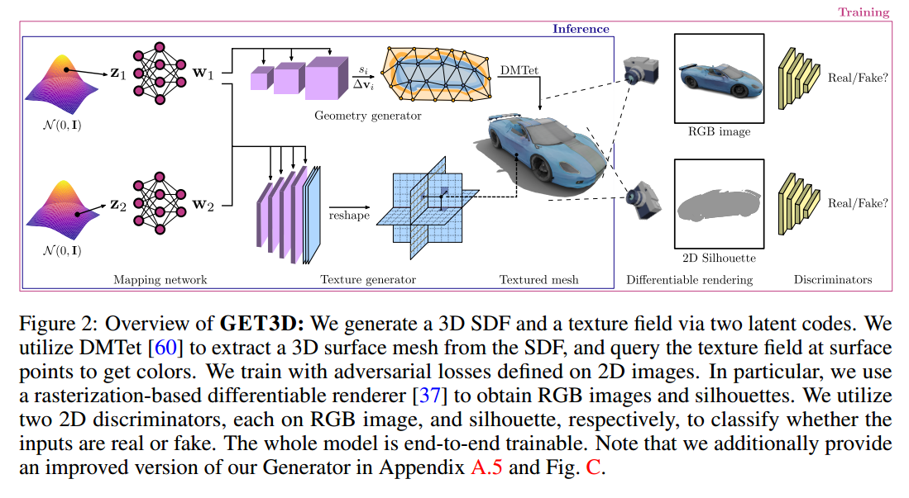

# GET3D论文
## Overview
当前实际应用对3D生成模型的要求如下：(a)它们应该有能力生成具有详细几何形状和任意拓扑的形状，(b)输出应该是一个纹理网格，这是标准图形软件包使用的主要表示，以及(c)我们应该能够利用2D图像进行监督，因为它们比明确的3D形状更广泛可用。

在这项工作中，作者介绍了一种新颖的方法，旨在解决实际有用的3D生成模型的所有要求。具体来说，提出了GET3D，这是一种3D形状的生成模型，可以直接输出具有高几何和纹理细节以及任意网格拓扑的显式纹理3D网格。该方法的核心是一个生成过程，它利用了可微显式表面提取方法和可微渲染技术。前者能够直接优化和输出任意拓扑的纹理三维网格，而后者用二维图像训练模型，从而利用为二维图像合成而开发的强大而成熟的鉴别器。由于模型直接生成网格并使用高效的(可微分的)图形渲染器，可以轻松地扩展模型，以高达1024 × 1024的图像分辨率进行训练，从而能够学习高质量的几何和纹理细节。

## 3. 整体方法
### 3.1 三维纹理网络的生成模型
目标是学习3D生成器M,E = G(z)，将高斯分布z∈N(0, 1)中的样本映射到纹理E的网格M。

由于相同的几何形状可以有不同的纹理，并且相同的纹理可以应用于不同的几何形状，因此作者对两个随机输入向量$z_1 ∈ R^{512}$和$z_2 ∈ R^{512}$进行采样。在StyleGAN[34,35,33]之后，我们使用非线性映射网络$f_{geo}$和$f_{tex}$将$z_1$和$z_2$映射到中间隐向量$w_1 = f_{geo}(z_1)$和w2 = ftex(z2)，它们分别用于生成控制3D形状和纹理生成的样式。我们将在3.1.1节中正式介绍几何生成器和3.1.2节中的纹理生成器。

#### 3.1.1 几何生成器
设计几何生成器包含DMTET。