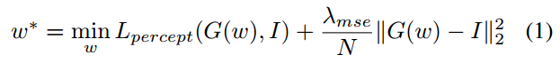

# Image2StyleGAN论文详解
提出了一种将给定图像嵌入到StyleGAN隐空间的有效算法。这种嵌入使语义图像编辑操作可以应用于现有的照片。以在FFHD数据集上训练的StyleGAN为例，我们展示了图像变形、风格转移和表情转移的结果。研究嵌入算法的结果为StyleGAN潜在空间的结构提供了有价值的见解。我们提出了一组实验来测试什么类别的图像可以嵌入，如何嵌入，什么样的潜在空间适合嵌入，以及嵌入是否具有语义意义。

## 2、引言部分
此篇文章的贡献包括：
- 一种有效的嵌入算法，可以将给定的图像映射到预训练StyleGAN的扩展潜在空间W+中。
- 研究了多个问题，以深入了解StyleGAN 隐空间的结构，例如:可以嵌入哪种类型的图像?什么类型的面孔可以被嵌入?什么潜伏空间可用于嵌入?
- 提出了三种基本的向量运算来研究嵌入的质量。因此，我们可以更好地理解隐空间以及不同类别的图像是如何嵌入的。结果，在多种面部图像编辑应用中获得了出色的效果，包括变形，风格转移和表情转移。

## 3、哪些图片可以被嵌入到StyleGAN的隐空间
这个问题是非平凡的，因为在他们最初对人脸和其他的GAN网络的嵌入实验结果中，人脸不再被识别为同一个人了。

### 不同图像类的嵌入结果
如图1所示，虽然比人脸略差，但我们可以获得合理的、相对高质量的猫、狗甚至绘画和汽车嵌入。这表明了算法的有效嵌入能力和生成器学习滤波器的通用性

### 人脸图像嵌入的鲁棒性
#### 仿射变换
如图2和表1所示，StyleGAN嵌入的性能对仿射变换(平移、调整大小和旋转)非常敏感。

#### 嵌入有缺陷的图像
如图3所示，StyleGAN嵌入的性能对图像中的缺陷具有很强的鲁棒性。可以看出，不同面部特征的嵌入是相互独立的。例如，去除鼻子对眼睛和嘴巴的嵌入没有明显的影响。一方面，这种现象对一般的图像编辑应用是有利的。另一方面，它表明潜在空间并没有强迫嵌入的图像是一个完整的脸，即它没有补上缺失的信息。

### 选择哪个隐空间
W+隐空间：W+是18个不同的512维W向量的串联，StyleGAN架构的每一层都有一个W向量，可以通过AdaIn接收输入

## 4、该嵌入有哪些意义？
作者提出了3个测试来评估嵌入是否有语义上的意义。每个测试都能够通过简单的隐码向量$w_i$的变化。这些测试对应于计算机视觉和计算机图形学中的语义图像编辑应用:变形、表达转移和风格转移。如果最终的操作产生高质量的图像，就认为测试成功。

### 4.1 变形
给定被嵌入到W+空间的两个隐向量$w_1和w_2$，可以通过线性插值变换来变形。$w = λw_1 + (1-λ)w_2$，然后可以用新的隐码w生成图像。如下图所示，作者的方法在人脸图像(第1,2,3行)之间生成高质量的变形，但在非人脸图像(第4行)和类间(第5行)变形中都失败。有趣的是，在类间变形的中间图像中可以观察到人脸的轮廓，这表明该StyleGAN的潜在空间结构是专门针对人脸的。因此，作者推测，非人脸图像实际上是通过以下方式嵌入的。最初的图层创建了一个像脸一样的结构，但后来的图层在这个结构上作画，所以它不再是可识别的。虽然变形本身的广泛研究超出了本文的范围，但作者认为面部变形的结果是优秀的，并且可能优于当前的这个形态。

### 4.2 风格转移
给定两个隐码$w_1和w_2$，风格迁移通过交叉操作计算。展示了嵌入的风格化图像与其他人脸图像之间的样式转移结果，以及来自不同类别的嵌入图像之间的样式转移结果。

作者的方法能够转移低级特征(例如:颜色和纹理)，但不能忠实地维护非人脸图像的内容结构(图8第二列)，尤其是绘画。这一现象表明，StyleGAN的泛化和表达能力更可能存在于空间分辨率较高的样式层中。

### 表情转换和面部再现
给定三个输入向量w1, w2, w3，表达式转移计算为w = w1 + λ(w3−w2)，其中w1为目标图像的潜码，w2对应源图像的中性表达，w3对应更明显的表达。例如，w3可以对应于同一个人的一张微笑的脸，w2可以对应于同一个人的一张没有表情的脸。为了消除噪声(例如背景噪声)，作者启发式地在差分潜码通道的L2-范数上设置了一个下界阈值，在该阈值以下，通道被零向量取代。对于上述实验，阈值的选择值为1。然后将结果向量归一化以控制表达式在特定方向上的强度。这样的代码相对独立于源面，可以用来转移表情(图7)。最终作者认为这些表情转移结果也是非常高质量的。补充材料和随附视频提供了更多的结果。

## 5. 嵌入算法
从一个合适的初始化w开始，搜索一个优化向量w*，使得测量给定图像与由w*生成的图像之间的相似性的损失函数最小化。算法1显示了作者的方法的伪代码。这项工作的一个有趣的方面是，并不是所有的设计选择都会导致好的结果，而对设计选择的实验提供了对嵌入的进一步了解。

### 5.1 初始化
随机？不行！
到平均的隐向量$\overline{w}$的距离可以用来识别低质量的人脸。因此，建议使用$\overline{w}$作为初始化，并期望优化收敛到更接近$\overline{w}$的向量w

### 5.2 损失函数
为了在优化过程中衡量输入图像和嵌入图像之间的相似性，作者使用了一个损失函数，它是VGG-16感知损失和逐像素MSE损失的加权组合:

其中$L_{percept}$条目为

其中I1, I2∈R n×n×3为输入图像，$F_j$为vgg16层的特征输出，分别为conv1_1, conv1_2, conv3_2和conv4_2, $N_j$为第j层输出的标量数，$λ_j$ = 1

## 一个核心的问题在于，这个思路是不是能用到3D模型反演成GET3D中
在此篇文章中花费了大量的篇幅证明，把人脸照片反演到StyleGAN的隐空间是可行的，但对于3D模型，反演成GET3D的两个分支的latent code是否可行尚待商榷。我认为单纯的优化反演可能是一个比较难以实现的方式，因为3D两个分支应该具有一致性。