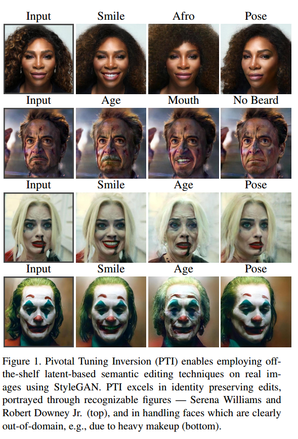

# Pivot Tuning for Latent-based Editing of Real Images
## brief
最近，一大批先进的面部编辑技术被提出，利用预先训练的StyleGAN的生成能力。要成功地以这种方式编辑图像，必须首先将图像投影(或反转)到预训练的生成器的域中。然而，事实证明，StyleGAN的潜在空间在扭曲和可编辑性之间引发了一种内在的权衡，即在保持原始外观和令人信服地改变其某些属性之间进行权衡。实际上，这意味着将保留id的人脸潜在空间编辑应用于生成器域之外的人脸仍然具有挑战性。在本文中，我们提出了一种弥合这一差距的方法。我们的技术稍微改变了生成器，使域外图像忠实地映射到域内潜在代码。关键思想是pivotal Tuning-一个简短的训练过程微调，保留域内latent region的编辑质量，同时改变其描绘的身份和外观。在Pivotal Tuning Inversion(PTI)中，一个初始的反转潜码作为一个支点，围绕它对生成器进行微调。同时，正则化项保持附近恒等式的完整性，以局部包含影响。这种外科训练过程最终改变了主要代表身份的外观特征，而不影响编辑功能。为了补充这一点，我们进一步表明，枢纽调谐也可以调整生成器以适应大量的面，同时在域的其余部分引入可忽略不计的失真。我们通过反演和编辑指标来验证我们的技术，并显示出比最先进的方法更可取的分数。我们通过应用高级编辑(如姿势，年龄或表情)来进一步定性地展示我们的技术，以众多知名和可识别身份的图像。最后，我们展示了对更困难的情况的复原力，包括浓妆、精致的发型和/或头饰，否则这些都不可能通过最先进的方法成功地反转和编辑。

## 本文的方法
我们的方法旨在使用StyleGAN为真实图像提供高质量的编辑。我们的方法的关键思想是，由于StyleGAN的非纠缠性质，可以在不损害其强大的编辑功能的情况下，对其产生的外观进行轻微和局部的更改。因此，给定的图像，可能是不分布的外观(例如，真实的身份，极端的照明条件，浓妆，和/或奢侈的头发和头饰)，我们建议在生成器的域内找到它最近的可编辑点。然后，这个关键点可以被拉向目标，对其附近的影响很小，对其他地方的影响可以忽略不计。在本节中，我们提出了一种两步方法，将真实图像倒置为高度可编辑的潜在代码。首先，我们在StyleGAN的原生潜在空间w中将给定的输入反转为wp，然后，我们对该枢轴代码wp应用Pivotal Tuning来调整预训练的StyleGAN以产生输入wp所需的图像。这里的驱动直觉是，由于wp足够接近，训练生成器从枢轴生成输入图像可以通过仅增加与外观相关的权重来实现，而不会影响StyleGAN潜在空间的良好结构

### 反演
反转步骤的目的是为Pivot Tuning步骤提供一个方便的起点。

