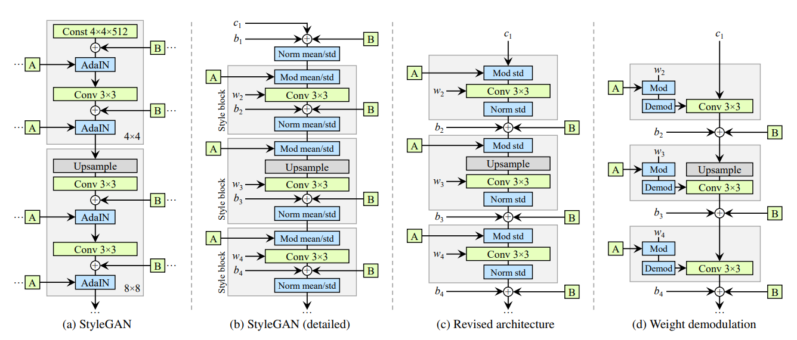
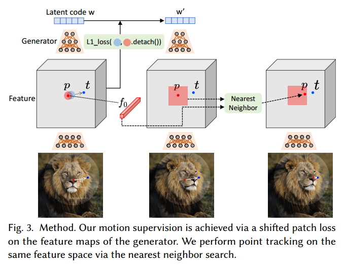

# DragGAN论文
## StyleGAN2架构
在styleGAN2的架构中，通过映射网络把512维的映射到中间代码r。该空间被我们称为w隐空间。在这个过程中，r可能会被发送到生成器G的不同层，以控制不同级别的属性。或者也可以对不同的层使用不同的r，那么输入可能就是$w∈R^{l×512} = W^+$。这样较少约束的W+空间被证明更具有表现力。当生成器𝐺学习从低维潜在空间到高维图像空间的映射时，它可以被看作是对图像流形的建模。

## DragGAN Overview
对于GAN生成的图片$I∈R^{3×H×W}$和它的隐码w，允许用户输入一些拖拽点和它们对应的目标点${p_i, t_i}$。目标就是把对应的语义点(例如图中的鼻子和下巴)变到目标点。

给定这些用户输入，我们以一种优化的方式执行图像处理。如图2所示，每个优化步骤包括两个子步骤，**1)运动监督**和**2)点跟踪**。在运动监督中，使用一种强制处理点向目标点移动的损失来优化潜在代码。经过一个优化步骤，我们得到了一个新的潜在代码w'和一个新的图像I'。更新将导致图像中对象的轻微移动。请注意，运动监督步骤只将每个手柄点移动一小步，但步骤的确切长度是不清楚的，因为它受到复杂的优化动力学的影响，因此不同的对象和部件会有所不同。因此，我们随后更新句柄点${p}$的位置，以跟踪对象上相应的点。这个跟踪过程是必要的，因为如果没有准确地跟踪手柄点(例如，狮子的鼻子)，那么在下一个动作监督步骤中，就会监督错误的点(例如，狮子的脸)，从而导致不希望的结果。跟踪后，根据新的句柄点和潜在代码重复上述优化步骤。这个优化过程一直持续到句柄点${p}$到达目标点${t}$的位置，在我们的实验中通常需要30-200次迭代。用户还可以在任何中间步骤停止优化。编辑完成后，用户可以输入新的句柄和目标点，继续编辑，直到满意为止。

## Motion Supervision
在DragGAN中提出了一个运动监督损失，这个运动损失没有用额外的神经网络参数。而是使用了发生器生成的中间特征，即考虑**styleGAN2第6块之后的特征映射F？**，由于在分辨率和判别性之间做了良好的权衡，所以它在所有特征中的表现是最好的。然后通过双线性插值的方法，让这个F具有和生成图像相同的分辨率。对于某个特征点$p_i$，我们的想法就是监督他周围的一圈点，然后这周围一圈的点都向着目标点移动一小步。用$Ω1(𝒑，𝑟1)$表示到p的距离小于r1的像素点，那么我们的运动监督损失如下:

式中，F(𝒒)表示F在像素𝒒处的特征值，$d_i = \frac {t_i-p_i}{||t_i-p_i||_2}$是指向𝒑的归一化向量(如果$t_i = p_i$，则 $d_i= 0$)，$F_0$是初始图像对应的特征映射。注意，第一项是对所有句柄点$p$求和。由于$q_i+d_i$可能不是整数，我们通过双线性插值得到其值。重要的是，当使用该损失进行反向传播时，梯度不会通过$F(q_i)$进行反向传播？。因此, 这会激励着$p_i$向着$p_i+d_i$移动而不是反过来。

## Point Tracking
因此，我们提出了一种新的gan点跟踪方法。gan的判别特征很好地捕获了密集的对应关系，因此可以通过特征补丁中的最近邻搜索有效地进行跟踪。具体地说，我们将初始处理点的特征表示为$f= F_0(p_i)$。我们表示$p_i$周围的补丁为$Ω2(p_i,r_2) = \{(x,y) | |x-x_p, i| < r_2, |y-y_p, i| < r_2\}$。那么其实点追踪需要寻找的点就是在$Ω2(p_i,r_2)$中找到$f_i$最近的邻居。
$$
p_i := argmin_{q_i∈Ω2(p_i,r_2)}||F'(q_i)-f_i||_1
$$
在这样的方式下，更新我们的句柄点p以跟踪对象。

## 为什么用Drag3D用DragGAN+GET3D
其实DragGAN本身就是drag一个GAN生成的图像而不是一个给定的输入图片。DragGAN的输入就是通过GAN生成的图片I和隐码w，然后通过每一轮的运动监督和点跟踪慢慢地把隐码w变成w'。Drag3D的大致步骤是差不多的，只不过他track的point是3D点，每一轮修改的latent code有mesh和geometry。然后通过DMTet从随机顶点生成mesh的顶点verts和面片faces。